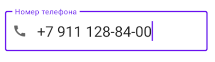

# PhoneEditText-library

Provide phone mask for InputEditText in your code



## Implementation:

Add it to your project build.gradle:

```gradle
allprojects {
    repositories {
        maven { url "https://jitpack.io" }
    }
}
```
and in module build.gradle:

```gradle
dependencies {
    implementation 'com.github.stslex:PhoneEditText-library:0.1.0'
}
```

## How to use

```xml
<com.google.android.material.textfield.TextInputLayout
        android:layout_width="match_parent"
        android:layout_height="wrap_content">

        <st.slex.library.PhoneTextInputEditText
            android:layout_width="match_parent"
            android:layout_height="wrap_content" />

    </com.google.android.material.textfield.TextInputLayout>
```

## In the code

```kotlin
/*Set country code to your editText*/
editText.setCountryCode(countryCode)

/*Set region code to your editText*/
editText.setRegionCode(regionCode)

/*Return true if phone number is valid*/
editText.isTextValidInternationalPhoneNumber()

/*Set phone numver*/
editText.setInternationalPhoneNumber(phone number)
```
